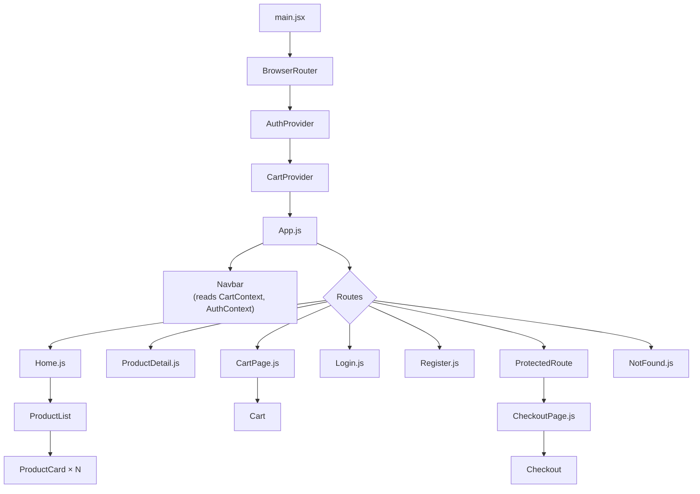

# MARQUE — E-commerce Frontend Capstone

A fully functional catalog-style e-commerce frontend built with React, React Router, and the Context API. Built for **Week 8: Capstone Project** of The Developers Arena frontend internship.

**Live catalog data:** [FakeStoreAPI](https://fakestoreapi.com)

---

## 1. Project Overview & Objectives

MARQUE is a boutique product catalog that lets a shopper browse products, filter and sort them, view full product detail pages, build a persistent shopping bag, create a simulated account, and complete a validated checkout flow. It brings together everything covered across the eight-week internship — component architecture, routing, global state, API integration, form validation, performance optimization, and deployment — into a single production-ready application.

**Objectives (from the Week 8 brief)**
- Recreate a real storefront's core user journey: browse → detail → bag → checkout.
- Demonstrate clean separation of concerns between UI components, state (contexts), and data access (services/hooks).
- Meet every technical requirement in the assignment — see §14 for the full checklist against each one.
- Ship something that is genuinely deployable, not a toy demo — real code splitting, real form validation, real error handling.

---

## 2. Setup Instructions

**Prerequisites:** Node.js 18+ and npm.

```bash
# 1. Install dependencies
npm install

# 2. Start the dev server (http://localhost:5173)
npm run dev

# 3. Run the unit test suite
npm test

# 4. Build for production (outputs to /dist)
npm run build

# 5. Preview the production build locally
npm run preview
```

No environment variables or API keys are required — the app talks to the public FakeStoreAPI directly.

---

## 3. Code Structure

```
src/
  App.js                      Route definitions, lazy-loaded pages, providers wiring
  App.css                     App-shell (footer) styles
  main.jsx                    Entry point — mounts Router + AuthProvider + CartProvider

  components/
    Navbar/                   Sticky nav: wordmark, links, cart badge, auth state
    ProductList/               Filter/sort controls + responsive product grid
    ProductCard/                Individual catalog card ("ticket-stub" styling)
    Cart/                       Bag line items, quantity controls, subtotal
    Checkout/                   Shipping + payment form, validation, order summary
    Loading/                    Reusable loading indicator
    ErrorBoundary/              Catches render errors, shows a recovery screen
    ProtectedRoute.js           Redirects to /login if the route requires auth

  pages/
    Home.js                    Hero + ProductList, shows order confirmation banner
    ProductDetail.js            Single product fetch + add-to-bag
    CartPage.js                 Wraps <Cart />
    CheckoutPage.js              Wraps <Checkout />, is route-protected
    Login.js / Register.js       Simulated auth forms
    NotFound.js                  404 fallback

  contexts/
    CartContext.js              Cart state (useReducer) + localStorage persistence
    AuthContext.js               Simulated auth (register/login/logout) via localStorage

  hooks/
    useProducts.js               Fetches products + categories, exposes filter/sort state

  services/
    api.js                       All fetch() calls to FakeStoreAPI live here

  styles/
    variables.css                 Design tokens (color, type, spacing)
    global.css                    Resets + shared utility classes (.btn, .container, ...)
```

**Why this structure?** Components own their own markup + styles (co-located `.css`); contexts and hooks own state and data logic; `services/api.js` is the only file that knows about the network. That means a component never calls `fetch` directly, and swapping the backend later only touches one file.

---

## 4. Architecture Decisions

- **Vite + React 19** for fast dev/build tooling and native ES modules.
- **React Router v7** (`react-router-dom`) handles all client-side routing, including a protected `/checkout` route.
- **Context API over Redux.** The app has exactly two pieces of cross-cutting state — cart and auth — each with a small, well-defined action set. `useReducer` inside `CartContext` gives Redux-like predictability (a single `cartReducer` function, fully unit tested) without adding a dependency.
- **Local component state** (`useState`) is used for anything that doesn't need to be shared: form fields, "just added" button feedback; filter/sort selection lives in `useProducts` since only `ProductList` and `Home` need it.
- **Simulated auth**, exactly as scoped by the assignment: `AuthContext` stores registered users and the current session in `localStorage`. No real backend or password hashing — this is intentionally a frontend-only demonstration of protected routes and auth-aware UI, not a production auth system.

---

## 5. Component Hierarchy Diagram



**Data flow:** `useProducts` fetches from `services/api.js` and hands filtered/sorted data down to `ProductList` → `ProductCard`. Clicking "Add to bag" calls `addToCart` from `CartContext`, which updates state and localStorage; `Navbar`'s bag count re-renders automatically because it also consumes `CartContext`. `Checkout` reads `CartContext` for line items/subtotal and `AuthContext` for the signed-in user's name, validates the form locally, then calls `clearCart()` and navigates home on submit.

*(GitHub, GitLab, and most Markdown viewers render the diagram above automatically. If your grader views the raw file instead, here's the same hierarchy as a tree:)*

```
main.jsx
 └─ BrowserRouter
     └─ AuthProvider
         └─ CartProvider
             └─ App
                 ├─ Navbar (reads CartContext, AuthContext)
                 └─ Routes
                     ├─ Home ──────── ProductList ── ProductCard (×N)
                     ├─ ProductDetail
                     ├─ CartPage ──── Cart
                     ├─ Login / Register
                     └─ CheckoutPage (ProtectedRoute) ── Checkout
```

---

## 6. State Management Approach

| State | Where it lives | Why |
|---|---|---|
| Cart line items | `CartContext` (`useReducer`) | Needed by Navbar, Cart, Checkout — genuinely global |
| Auth session | `AuthContext` | Needed by Navbar, ProtectedRoute, Checkout |
| Product list + filters/sort | `useProducts` hook, used only in `Home` | Local to one screen, no need to lift higher |
| Form fields (Checkout/Login/Register) | `useState` in the component | Never read outside that form |
| "Added to bag" button feedback | `useState` in `ProductCard` | Purely presentational, per-card |

Both cart and auth state persist to `localStorage` so a refresh doesn't lose the bag or log the user out.

---

## 7. API Integration Details

All requests go through `src/services/api.js`, a thin wrapper around `fetch`:

- `getProducts()` → `GET /products`
- `getProduct(id)` → `GET /products/:id`
- `getCategories()` → `GET /products/categories`
- `getProductsByCategory(category)` → `GET /products/category/:category`

`useProducts` fetches the full catalog and category list once on mount (`Promise.all`), then does filtering/sorting **client-side** with `useMemo` — this avoids re-fetching on every filter change and keeps the UI instant. `ProductDetail` fetches a single product on demand, keyed off the route's `:id` param, with its own loading/error state.

Every API call is wrapped in try/catch; network failures and non-200 responses surface a human-readable message in the UI rather than a blank screen.

---

## 8. Performance Optimizations

- **Route-level code splitting** via `React.lazy` + `Suspense` in `App.js` — every page is its own chunk, confirmed in the production build output (separate `Home`, `ProductDetail`, `CartPage`, `CheckoutPage`, `Login`, `Register`, `NotFound` bundles).
- **Lazy image loading** — `loading="lazy"` on all product images (catalog grid and cart thumbnails).
- **Client-side filtering/sorting with `useMemo`** — avoids refetching or recomputation on every render.
- **`mix-blend-mode: multiply`** used instead of image processing to make FakeStoreAPI's white-background product photos sit naturally on the paper background, at zero runtime cost.
- **Reduced-motion respected** — all animation is disabled under `prefers-reduced-motion: reduce`.

---

## 9. Testing Evidence

Unit tests (Vitest) cover the two most logic-heavy, side-effect-free pieces of the app:

- `src/contexts/CartContext.test.js` — 6 tests covering the `cartReducer`: adding a new item, incrementing an existing line, removing an item, quantity going to zero, quantity clamped at zero, and clearing the cart.
- `src/components/Checkout/Checkout.test.js` — 7 tests covering the checkout `validate()` function: a fully valid form, a missing name, an invalid postal code, a malformed card number, an accepted card number with spaces, a malformed expiry date, and a too-short CVV.

```
 ✓ src/contexts/CartContext.test.js (6 tests)
 ✓ src/components/Checkout/Checkout.test.js (7 tests)

 Test Files  2 passed (2)
      Tests  13 passed (13)
```

Run them yourself with `npm test`. Manual end-to-end testing was also performed for: browsing → filtering by category → sorting by price/rating → viewing a product detail page → adding to bag from both the grid and the detail page → adjusting/removing bag quantities → registering an account → being redirected to `/login` when visiting `/checkout` unauthenticated → completing checkout with both invalid and valid form data → confirming the bag clears and the order-confirmation banner appears on return to Home.

---

## 10. Deployment Steps

The app is a static build, so it deploys to any static host. Config files for both major platforms are included:

**Netlify** (`netlify.toml` included)
1. Push this repo to GitHub.
2. In Netlify: "Add new site" → "Import an existing project" → pick the repo.
3. Build command: `npm run build`, publish directory: `dist` (already set in `netlify.toml`, including the SPA redirect rule needed for client-side routing).

**Vercel** (`vercel.json` included)
1. Push this repo to GitHub.
2. In Vercel: "Add New Project" → import the repo → framework preset "Vite" is auto-detected.
3. Deploy. `vercel.json` handles the SPA rewrite so routes like `/product/3` work on a hard refresh.

Either way, remember: client-side routing means the host must serve `index.html` for unknown paths — that's exactly what both config files above do.

**GitHub Pages** (if deploying straight from this repo instead of Netlify/Vercel)

GitHub Pages serves project sites at a subpath (`your-username.github.io/repo-name/`), not the domain root, so two extra things are needed that Netlify/Vercel don't require:

1. `vite.config.js` has `base: '/your-repo-name/'` set to match your exact repo name.
2. A `postbuild` script copies `dist/index.html` to `dist/404.html` — GitHub Pages has no server-side rewrites, so without this, refreshing any route other than `/` (e.g. `/product/3`) shows a 404. Copying `index.html` there means GitHub Pages serves the app shell on any unknown path, and React Router takes over client-side from there.

To deploy:
```bash
npm install           # picks up the gh-pages package already in package.json
npm run deploy         # builds, then pushes /dist to the gh-pages branch
```
Then in the repo on GitHub: **Settings → Pages → Build and deployment → Source: Deploy from a branch → Branch: `gh-pages`**.

---

## 11. Challenges Faced

- **JSX inside `.js` files.** The submission structure specifies component files with a `.js` extension (not `.jsx`), but they contain JSX. Vite's default toolchain expects `.jsx`/`.tsx` for that. Solved by explicitly configuring `esbuild.loader = 'jsx'` for files under `src/` in both `vite.config.js` and `vitest.config.js`, and pinning `@vitejs/plugin-react` to a release compatible with the classic (non-Rolldown) Vite pipeline used here.
- **Simulated auth vs. real persistence.** Since there's no backend, "registering" and "logging in" both live in `localStorage`. This is clearly documented in `AuthContext.js` as a simulation, not a security pattern to reuse.
- **Keeping filters snappy.** Refetching from the API on every filter/sort change would feel sluggish. Fetching once and deriving the visible list with `useMemo` keeps interactions instant.
- **Ticket-stub card styling.** Getting the perforated notch on `ProductCard` to look intentional (not glitchy) at every grid width took a few passes — solved with two pseudo-elements pinned to the card's left edge rather than trying to clip the card itself.

---

## 12. Visual Documentation

Screenshots aren't included in this zip — this project was built in a sandboxed environment with no GUI and no access to download a headless browser, so there's no way to render and capture the app here. **You'll need to add these yourself before submitting**, it takes about five minutes:

1. `npm run dev`, open `http://localhost:5173`.
2. Take screenshots of: the catalog/home page, a product detail page, the bag with 1–2 items in it, the checkout form, and one narrow-window (mobile) view.
3. Save them into a `screenshots/` folder at the project root.
4. Reference them here:

```


```

---

## 13. Design Notes

The visual direction is a boutique mail-order catalog: linen paper background, ink type, a cranberry "stamp" accent, and monospace "ticket" labels for prices and SKUs (`NO. 0231`-style). Each product card has a perforated tear-off edge as the page's signature element. Typefaces: **Fraunces** (display, headings), **Work Sans** (body), **Space Mono** (prices, labels, nav).

---

## 14. Technical Requirements Checklist

A direct mapping from the assignment brief to where each requirement is met:

| Requirement | Met by |
|---|---|
| Responsive React application | `ProductList` grid (`repeat(auto-fill, minmax(230px, 1fr))`), and explicit breakpoints in `Navbar.css` (720px), `Cart.css`/`Checkout.css` (800px), `ProductDetail.css` (760px) — collapses to single-column / mobile nav below those widths |
| Modern routing (React Router) | `react-router-dom` v7 in `App.js` — `Routes`, `Route`, `Link`, `NavLink`, `useParams`, `useNavigate`, `useLocation` |
| Comprehensive state management (Context API) | `CartContext.js` (`useReducer`) and `AuthContext.js`, both consumed across multiple components (§6 has the full breakdown) |
| Integration with external e-commerce API | `services/api.js` → FakeStoreAPI, used via the `useProducts` hook and directly in `ProductDetail.js` (§7) |
| User authentication flow (simulated, Local Storage) | `AuthContext.js` — `register()`/`login()`/`logout()`, session persisted to `localStorage` |
| Shopping cart with persistent storage | `CartContext.js` — cart state persisted to `localStorage` via `useEffect`, survives refresh |
| Checkout process with form validation | `Checkout.js` — `validate()` function (unit tested, §9), inline field errors, disabled submit until valid |
| Performance: lazy loading + code splitting | `React.lazy`/`Suspense` per route in `App.js` (confirmed as separate build chunks, §8); `loading="lazy"` on all product images |
| Deployment readiness (Netlify/Vercel) | `netlify.toml` and `vercel.json` included with SPA redirect rules — **you still need to actually push this to GitHub and connect it to Netlify or Vercel yourself; that last step can't be done from inside this sandbox** |
| Protected routes | `ProtectedRoute.js` — redirects unauthenticated users away from `/checkout` to `/login` |
| Error handling | `ErrorBoundary.js` (render errors) + try/catch in `services/api.js` (network errors), both surfaced as readable UI states rather than a blank screen |

---

## 15. Extra Credit Ideas (not implemented)

- Wishlist / saved-for-later list
- Debounced text search across product titles
- Dark mode toggle
- Order history page (would need to persist completed orders, not just clear the cart)
